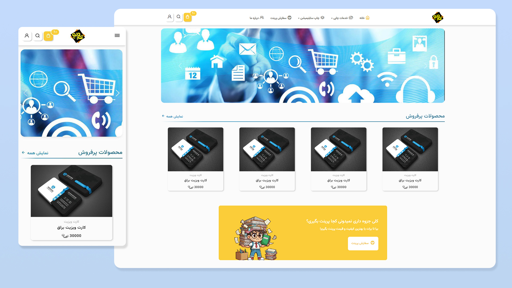
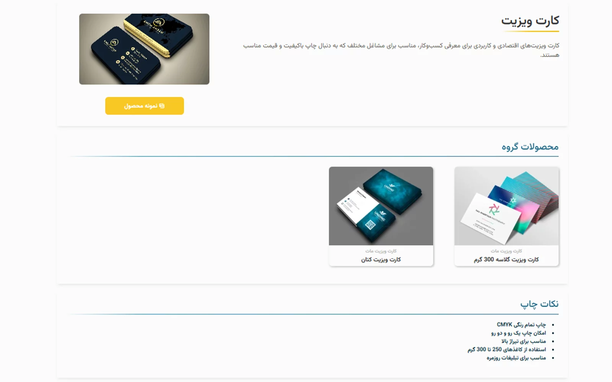
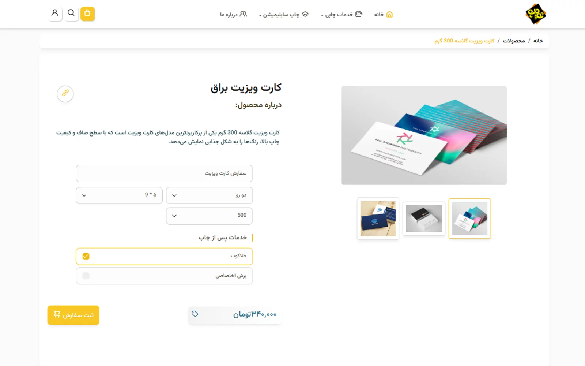
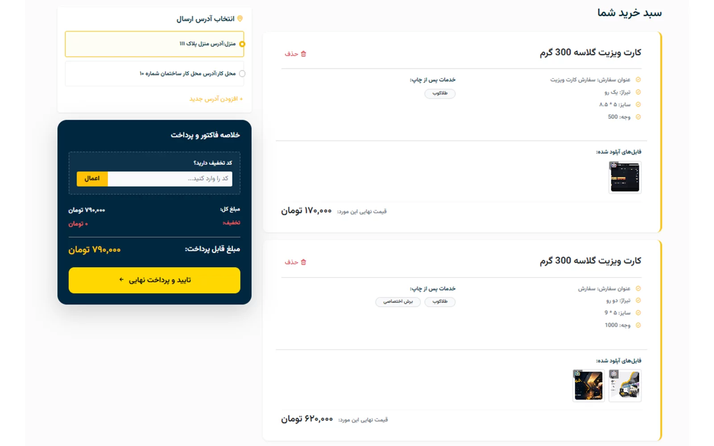
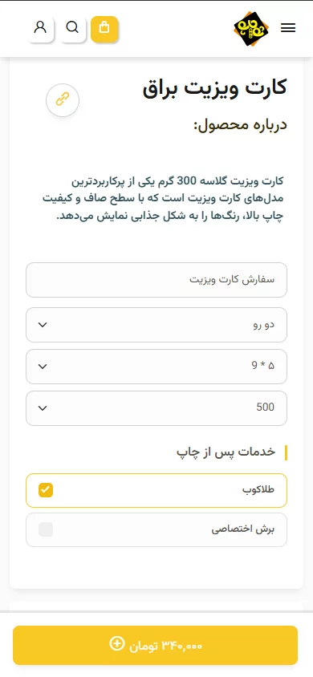

<div align="center">

# 🖨️ Shahr Chap — Print Shop E-Commerce Platform

**A full-stack ASP.NET Core e-commerce platform for a printing & reproduction business, built with a layered architecture, a custom permission system, and a dynamic product-configuration & pricing engine.**

[](https://dotnet.microsoft.com/)
[](https://learn.microsoft.com/ef/core/)
[](https://www.microsoft.com/sql-server)
[](LICENSE)

[Overview](#-overview) •
[Features](#-key-features) •
[Architecture](#-architecture) •
[Tech Stack](#-tech-stack) •
[Getting Started](#-getting-started) •
[Screenshots](#-screenshots)

</div>

---

## 📌 Overview

**Shahr Chap** ("City of Print") is a complete e-commerce web application for a print & reproduction shop, originally built for a client and continued independently as a portfolio project (currently ~95% feature-complete). It covers the full commerce lifecycle: browsing a configurable product catalog, uploading custom print files, cart management, checkout, order tracking, a customer wallet, and a full admin back-office.

The storefront UI is in **Persian (RTL)**, since it targets the Iranian market — but the codebase itself demonstrates transferable, framework-level engineering: a clean layered architecture, a hand-built role/permission authorization system, a dynamic pricing engine driven by product feature combinations, and a well-normalized relational data model.

> This repository is shared as a code/architecture sample. No demo deployment is currently available — see [Getting Started](#-getting-started) to run it locally.

## ✨ Key Features

- **Configurable product catalog** — products are composed of dynamic *Features* and *Feature Values* (e.g. paper type, size, finish), with prices resolved per unique combination (`ProductPrice.Combination`, enforced unique per product) rather than hardcoded per-SKU pricing.
- **Custom design orders** — customers can upload their own artwork/design files directly on cart items and orders (`CartItemFile`, `OrderFile`), for products marked as design-enabled.
- **Add-on services** — printing/finishing services can be attached to an order line with their own pricing (`OrderDetailService`, `ServicePrice`).
- **Cart → Checkout → Order pipeline** with order status tracking (`OrderStatus`, sortable admin-managed statuses).
- **Customer wallet** for balance-based payments/refunds (`Wallet`, `WalletType`).
- **Fine-grained authorization** — a custom `PermissionCheckerAttribute` (an `AuthorizeAttribute` + `IAuthorizationFilter`) enforces per-action, database-backed permissions per role, rather than relying on static `[Authorize(Roles=...)]` checks alone.
- **Full admin back-office** (Razor Pages under `/Admin`) — manage products, features, roles & permissions, order statuses, image gallery, and users.
- **Customer self-service panel** — a dedicated `UserPanel` MVC Area for order history, addresses, and account management.
- **OTP-based authentication** — mobile OTP delivery via SMS gateway integration, plus transactional email.
- **Soft-delete & auditability** — most entities use `IsDelete`/query filters (`HasQueryFilter`) instead of hard deletes.
- **Simulated payment flow** — a `PaymentSimulationController` stands in for a live payment gateway, so the full checkout flow can be demoed without a merchant account.

## 🏗️ Architecture

The solution follows a **3-tier layered architecture** with a strict, one-directional dependency flow:

```
ShahrChap.Web            →  Presentation layer (MVC + Razor Pages + Areas)
        ↓ depends on
ShahrChap.Core            →  Business logic layer (Services, DTOs, Security)
        ↓ depends on
ShahrChap.DataLayer        →  Persistence layer (EF Core, Entities, Migrations)
```

<details>
<summary><strong>📁 Project structure (click to expand)</strong></summary>

```
ShahrChap.DataLayer/
├── Context/           # ShahrChapContext (EF Core DbContext, Fluent API config)
├── Entities/
│   ├── User/           # User, Role, UserRole
│   ├── Permissions/     # Permission, RolePermission
│   ├── Product/         # Product, ProductGroup, Feature, FeatureValue,
│   │                     ProductPrice, Service, DesignPrice, ProductComment...
│   ├── Order/           # Order, OrderDetail, OrderStatus, OrderFile
│   ├── Cart/             # Cart, CartItem, CartItemFile, CartItemService
│   ├── Wallet/           # Wallet, WalletType
│   └── Address/          # Province, City, UserAddress
├── Enums/
└── Migrations/

ShahrChap.Core/
├── Services/            # UserService, ProductService, OrderService,
│                          CartService, PermissionService, SMSService,
│                          EmailService, FileStorageService...
│   └── Interfaces/       # One interface per service (DI-friendly, testable)
├── DTOs/                # ViewModels grouped by feature (User, Cart, Order, Product...)
├── Security/             # PermissionCheckerAttribute, PasswordHelper, validators
├── Convertors/           # Persian date conversion, text/number normalization
└── Options/              # Strongly-typed configuration (IOptions<T>)

ShahrChap.Web/
├── Controllers/          # Storefront: Home, Product, Cart, Checkout, Order, Account...
├── Areas/UserPanel/       # Customer dashboard (MVC Area)
├── Pages/Admin/           # Back-office (Razor Pages): Products, Users, Roles, Features...
├── ViewComponents/        # ShoppingCartComponent, ProductGroupComponent
└── Views/
```

</details>

**Notable design decisions:**

| Decision | Why it matters |
|---|---|
| Interfaces for every service (`IUserService`, `IProductService`, …) | Enables constructor injection and unit testing without touching EF Core directly |
| Feature/FeatureValue → ProductPrice combination model | Supports arbitrary product variants (size × material × finish, etc.) without schema changes per product type |
| Custom `PermissionCheckerAttribute` | Permission checks are data-driven (stored per role in `RolePermission`), so access control can change without a redeploy |
| Query filters for soft delete | Deleted records are excluded globally at the `DbContext` level, avoiding repeated `Where(x => !x.IsDelete)` boilerplate |
| Razor Pages for admin, MVC for storefront + a dedicated Area for the customer panel | Each surface uses the ASP.NET Core paradigm that fits it best, inside a single Web project |

## 🛠️ Tech Stack

**Backend**
- ASP.NET Core 10 (MVC + Razor Pages, mixed in one project via Areas)
- Entity Framework Core 10 (Code-First, Fluent API, Migrations)
- SQL Server
- Cookie-based Authentication & custom Authorization filters
- SixLabors.ImageSharp (server-side image processing)

**Frontend**
- Razor Views, jQuery + jQuery Validation, SweetAlert2

**Integrations**
- SMS gateway (OTP delivery for authentication)
- SMTP email service

**Tooling**
- .NET SDK 10 (pinned via `global.json`)
- EF Core CLI Migrations

## 🚀 Getting Started

### Prerequisites
- [.NET 10 SDK](https://dotnet.microsoft.com/download)
- SQL Server (LocalDB, Express, or full instance)
- Visual Studio 2022+ / JetBrains Rider / VS Code

### Setup

```bash
# 1. Clone the repository
git clone https://github.com/AlirezaHadian/ShahrChapV2Core.git
cd ShahrChapV2Core

# 2. Configure your connection string and secrets
#    Edit ShahrChap.Web/appsettings.json (or use dotnet user-secrets):
#      ConnectionStrings:ShahrChapDatabase
#      MessageSender:UserName / Password / Token   (SMS OTP provider)
#      Email:Address / Password                     (SMTP)

# 3. Apply EF Core migrations
cd ShahrChap.Web
dotnet ef database update --project ../ShahrChap.DataLayer

# 4. Run the project
dotnet run
```

The storefront will be available at the default ASP.NET Core Kestrel URL (e.g. `https://localhost:5001`), and the admin back-office at `/Admin` (an admin/permission record must exist in the database first).

> ⚠️ `appsettings.json` in this repo only ships placeholder values (`YOUR-CONNECTIONSTRING`, `YOUR-TOKEN`, etc.) — no real credentials are committed.

## 📸 Screenshots

<div align="center">

</div>

| Home page | Parent product page (variants & samples) |
|---|---|
|  |  |

| Product configurator (dynamic feature-based pricing) | Shopping cart |
|---|---|
|  |  |

<div align="center">

<br/>
<sub>Product page on mobile</sub>
</div>

> UI text is in Persian, as the storefront targets the Iranian market — see [Overview](#-overview).

## 🗺️ Status & Roadmap

This project is **~95% complete**. It was originally commissioned for a client who ultimately did not move forward with it; development has continued independently since, as a portfolio/architecture showcase.

Remaining/possible next steps:
- [ ] Integration with a live payment gateway (currently simulated)
- [ ] Automated test coverage (unit/integration tests)
- [ ] CI pipeline

## 📄 License

Distributed under the **MIT License**. See [`LICENSE`](LICENSE) for details.

## 👤 About the Author

**Alireza Hadian** — ASP.NET Core Developer (C#, Blazor, SQL Server)

[](https://alirezahadian.ir)
[](https://github.com/AlirezaHadian)
[](https://www.linkedin.com/in/AlirezaHadian)
